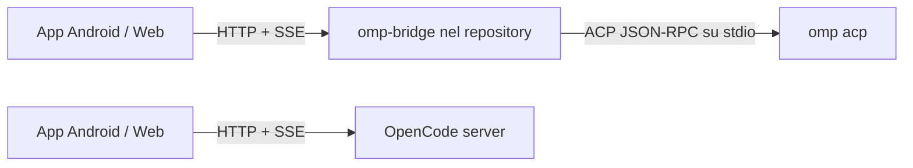

# Piano di integrazione Oh My Pi

## Identità prodotto

**Nome prodotto:** Harness Remote. OpenCode e OMP sono backend selezionabili; i loro nomi restano nei riferimenti a protocolli, comandi e contratti specifici.

## Decisione

L'app non può collegarsi direttamente a OMP: oggi parla l'API HTTP/SSE di OpenCode, mentre OMP espone ACP su stdio tramite `omp acp`. Serve quindi un bridge locale minimale, nello stesso repository, che traduca HTTP/SSE in ACP. Il bridge non deve mai leggere o modificare direttamente `~/.omp/agent/*.db`.



L'app seleziona il backend. OpenCode conserva il comportamento attuale; OMP usa il bridge.

## Architettura

### App

1. Introdurre `BackendKind = "opencode" | "omp"` in `web/src/types.ts` e salvarlo nella configurazione del server.
2. Estrarre da `web/src/api.ts` una piccola interfaccia `RemoteAdapter` per salute, sessioni, prompt, annullamento ed eventi.
3. Mantenere un `OpenCodeAdapter` con gli endpoint esistenti e aggiungere un `OmpAdapter` per l'API del bridge.
4. Usare capacità dichiarate dal backend per nascondere UI non supportata invece di simulare API OpenCode inesistenti.

```ts
type RemoteCapabilities = {
  sessions: true
  prompt: true
  abort: boolean
  streaming: boolean
  models: boolean
  agents: boolean
  todos: boolean
  diff: boolean
  filesystemBrowser: boolean
}
```

### Bridge

Nuova directory `bridge/`, pacchetto Node eseguibile dalla checkout locale con:

```bash
npx --yes ./bridge --port 4097
```

Struttura:

```text
bridge/
  package.json
  src/
    cli.ts
    server.ts
    acp-client.ts
    mapper.ts
    auth.ts
    config.ts
  test/
```

Il bridge usa `child_process.spawn` con argomenti separati per avviare `omp acp`; non concatena mai input remoto in una shell. Mantiene parser NDJSON JSON-RPC, request ID, promesse pendenti, router delle notifiche e riavvio controllato del processo ACP.

### Contratto HTTP OMP

Esporre solo l'API comune necessaria:

```text
GET    /v1/health
GET    /v1/capabilities
GET    /v1/sessions
POST   /v1/sessions
GET    /v1/sessions/:id
GET    /v1/sessions/:id/messages
POST   /v1/sessions/:id/prompts
POST   /v1/sessions/:id/abort
DELETE /v1/sessions/:id
GET    /v1/events
```

Eventi SSE normalizzati:

```text
event: session.updated
data: {"sessionId":"abc","status":"busy"}

event: message.delta
data: {"sessionId":"abc","role":"assistant","text":"..."}

event: todo.updated
data: {"sessionId":"abc","items":[...]}

event: session.completed
data: {"sessionId":"abc","status":"idle"}
```

## Ambito prima versione

Incluso:

- test di connessione;
- elenco, creazione, ripresa e chiusura sessioni;
- messaggi, prompt e streaming;
- stato busy/idle/errore;
- stop se ACP lo espone;
- modelli e todo solo se ACP li espone in modo verificato.

Escluso finché non supportato in modo affidabile:

- endpoint `/command` OpenCode;
- browser dell'intero filesystem;
- diff e dashboard VCS;
- lista agenti nello stile OpenCode;
- endpoint di compatibilità fittizi.

## Stato dell'implementazione

Completato:

- bridge locale `bridge/`, eseguibile con `npx --yes ./bridge`;
- handshake, autenticazione e sessioni ACP contro OMP locale;
- health, sessioni, messaggi, todo, prompt asincroni, annullamento ed eventi SSE;
- directory browser confinato alle root `--root`;
- selezione OpenCode/OMP nella configurazione Android, con porta e username predefiniti corretti;
- svuotamento immediato di sessione e stato quando viene salvata una configurazione backend diversa;
- bridge: catalogo modelli OMP per una sessione attiva, applicazione tramite `session/set_config_option`, caricamento concorrente sincronizzato e messaggi utente registrati prima dello streaming assistant;
- UI OMP senza selettore agenti fittizio.
- bridge `v0.1.5` distribuibile come `opencode-remote-omp-0.1.5.tgz`, con handshake ACP, errori/notifiche, restart, Basic Auth, mapping sessioni, refresh cronologia per revisione ACP e confinamento `--root`;
- smoke reale contro OMP `v17.0.8` per health, discovery e ripristino della cronologia via `session/load`.

Ancora intenzionalmente non supportato: rinomina/eliminazione persistente di una sessione OMP, comandi server OpenCode, agenti OMP configurabili, diff/VCS e accesso filesystem fuori dalle root consentite.

## Risoluzione: pannello AI Model OMP

**Causa dimostrata:** due richieste HTTP concorrenti per una sessione esistente (`/session/:id/message` e `/config/providers?...&sessionID=:id`) potevano entrambe entrare in `OmpService.#load`. La prima registrava prematuramente la cache dei messaggi e attendeva `session/load`; la seconda scambiava quella cache per una sessione già caricata, leggeva `configOptions` ancora assenti e il bridge restituiva `providers: []`. L'app mostra una lista vuota come `Loading configured models...`.

**Correzione:** `OmpService` mantiene ora sia le sessioni caricate sia le promesse di caricamento in corso. Tutti i consumatori della stessa sessione attendono la medesima richiesta ACP `session/load`; solo dopo la risposta vengono esposti modelli e messaggi.

**Prove eseguite:**

- test HTTP di regressione del bridge con `session/load` deliberatamente ritardato: `/config/providers` resta in attesa, poi restituisce il provider e il modello predefinito; viene inviata una sola richiesta ACP;
- suite bridge completa: 13 test superati;
- build TypeScript, regressioni web, sync Capacitor Android superati;
- bundle `dist` e asset dentro l'APK debug esistente hanno lo stesso SHA-256;
- smoke reale con OMP `v17.0.8`: health riuscito; `--log-requests` ha registrato `GET /config/providers` con `directory` e `sessionID`, senza password o prompt.

**Limite dell'ambiente:** non sono disponibili né `adb` né Android SDK (`ANDROID_HOME`/`sdk.dir`); quindi non è stato possibile installare l'APK né acquisire logcat in questa workstation. La correzione del comportamento bridge è coperta dal test concorrente, ma la verifica manuale nativa resta da eseguire su un host con dispositivo e SDK.

## Risoluzione: ordine messaggi OMP

**Causa dimostrata:** `session/prompt` avviava ACP in background e affidava il messaggio utente alla notifica `user_message_chunk`. ACP può invece consegnare un chunk assistant prima di quella notifica; la chat riceveva quindi assistant, poi user.

**Correzione:** il bridge registra il prompt utente localmente e lo espone prima di avviare `session/prompt`. I chunk user ACP corrispondenti vengono riconosciuti e non duplicano il messaggio, anche se arrivano dopo il primo chunk assistant.

**Prova:** regressione HTTP che inverte intenzionalmente le notifiche ACP (assistant, poi user) e verifica la sequenza restituita: user, assistant.

**Persistenza verificata:** un bridge nuovo, senza cache in memoria, ha riaperto due sessioni OMP reali e ha ricevuto da ACP entrambi i messaggi user e assistant nell'ordine corretto. Il bridge `v0.1.5` ricarica una revisione esterna con il client ACP principale senza riavviarlo, evitando cache parziali e l'interruzione di prompt attivi.

## Sicurezza

- Bind di default: `127.0.0.1`.
- Per LAN: autenticazione Basic compatibile con l'app.
- Directory di lavoro limitate a root esplicitamente consentite da `--root`.
- Risoluzione del path reale per prevenire traversal e symlink escape.
- Mai esporre il bridge direttamente su Internet; usare VPN/Tailscale/reverse proxy TLS.
- Log senza prompt, password o token.

## Implementazione

1. Verificare e fissare con test i payload ACP effettivi per `session/new`, `session/load`, `session/prompt`, cancellazione e notifiche.
2. Creare CLI bridge, health endpoint, autenticazione e lista sessioni.
3. Implementare nuova/riprendi sessione, prompt ed SSE.
4. Aggiungere l'adapter OMP e selettore backend nella UI.
5. Applicare capability gating.
6. Testare end-to-end dall'APK.
7. Aggiungere una capacità alla volta: abort, todo, modelli, VCS e directory.

## Stato e prossime capacità

La prima integrazione OMP è completata: connessione, sessioni, cronologia, prompt/streaming, annullamento, todo e modelli sono verificati. Il prossimo incremento deve essere scelto e verificato uno alla volta: agenti configurabili, rinomina/eliminazione persistente, VCS/diff oppure directory browser più ricco.

Le impostazioni dell'app si autosalvano dopo una breve pausa di digitazione; non esiste più una modifica silenziosamente persa al cambio di pagina. L'help in-app mantiene un solo esempio minimo per il backend selezionato e rimanda alle guide versionate nel repository. Le future integrazioni aggiungono una guida nel repository, non pagine di help sempre più grandi nell'APK.

## Verifica

Test unitari per parser ACP, mapping, auth, limitazione `--root` e restart. Test di integrazione contro un vero `omp acp`, non solo mock. Smoke test:

```bash
npx -y opencode-remote-omp --port 4097 --username omp --password 'segreto'
```

Dall'app: selezionare OMP, configurare IP e porta, verificare health, creare/riprendere sessione, inviare prompt, osservare streaming/completamento, riavviare il bridge e ricaricare la sessione.
