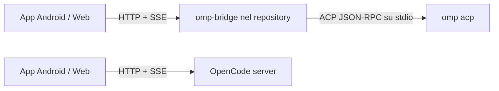

# Piano di integrazione Oh My Pi

## Decisione

L'app non può collegarsi direttamente a OMP: oggi parla l'API HTTP/SSE di OpenCode, mentre OMP espone ACP su stdio tramite `omp acp`. Serve quindi un bridge locale minimale, nello stesso repository, che traduca HTTP/SSE in ACP. Il bridge non deve mai leggere o modificare direttamente `~/.omp/agent/*.db`.



L'app seleziona il backend. OpenCode conserva il comportamento attuale; OMP usa il bridge.

## Architettura

### App

1. Introdurre `BackendKind = "opencode" | "omp"` in `web/src/types.ts` e salvarlo nella configurazione del server.
2. Estrarre da `web/src/api.ts` una piccola interfaccia `RemoteAdapter` per salute, sessioni, prompt, annullamento ed eventi.
3. Mantenere un `OpenCodeAdapter` con gli endpoint esistenti e aggiungere un `OmpAdapter` per l'API del bridge.
4. Usare capacità dichiarate dal backend per nascondere UI non supportata invece di simulare API OpenCode inesistenti.

```ts
type RemoteCapabilities = {
  sessions: true
  prompt: true
  abort: boolean
  streaming: boolean
  models: boolean
  agents: boolean
  todos: boolean
  diff: boolean
  filesystemBrowser: boolean
}
```

### Bridge

Nuova directory `bridge/`, pacchetto Node eseguibile dalla checkout locale con:

```bash
npx --yes ./bridge --port 4097
```

Struttura:

```text
bridge/
  package.json
  src/
    cli.ts
    server.ts
    acp-client.ts
    mapper.ts
    auth.ts
    config.ts
  test/
```

Il bridge usa `child_process.spawn` con argomenti separati per avviare `omp acp`; non concatena mai input remoto in una shell. Mantiene parser NDJSON JSON-RPC, request ID, promesse pendenti, router delle notifiche e riavvio controllato del processo ACP.

### Contratto HTTP OMP

Esporre solo l'API comune necessaria:

```text
GET    /v1/health
GET    /v1/capabilities
GET    /v1/sessions
POST   /v1/sessions
GET    /v1/sessions/:id
GET    /v1/sessions/:id/messages
POST   /v1/sessions/:id/prompts
POST   /v1/sessions/:id/abort
DELETE /v1/sessions/:id
GET    /v1/events
```

Eventi SSE normalizzati:

```text
event: session.updated
data: {"sessionId":"abc","status":"busy"}

event: message.delta
data: {"sessionId":"abc","role":"assistant","text":"..."}

event: todo.updated
data: {"sessionId":"abc","items":[...]}

event: session.completed
data: {"sessionId":"abc","status":"idle"}
```

## Ambito prima versione

Incluso:

- test di connessione;
- elenco, creazione, ripresa e chiusura sessioni;
- messaggi, prompt e streaming;
- stato busy/idle/errore;
- stop se ACP lo espone;
- modelli e todo solo se ACP li espone in modo verificato.

Escluso finché non supportato in modo affidabile:

- endpoint `/command` OpenCode;
- browser dell'intero filesystem;
- diff e dashboard VCS;
- lista agenti nello stile OpenCode;
- endpoint di compatibilità fittizi.

## Stato dell'implementazione

Completato:

- bridge locale `bridge/`, eseguibile con `npx --yes ./bridge`;
- handshake, autenticazione e sessioni ACP contro OMP locale;
- health, sessioni, messaggi, todo, prompt asincroni, annullamento ed eventi SSE;
- directory browser confinato alle root `--root`;
- selezione OpenCode/OMP nella configurazione Android, con porta e username predefiniti corretti;
- svuotamento immediato di sessione e stato quando viene salvata una configurazione backend diversa;
- bridge: catalogo modelli OMP per una sessione attiva e applicazione tramite `session/set_config_option`; il caricamento nell'APK resta bloccato, vedi il blocco sotto.
- UI OMP senza selettore agenti fittizio.
- suite bridge con handshake ACP, errori/notifiche, restart, Basic Auth, mapping sessioni e confinamento `--root`;
- smoke test reale contro OMP `v17.0.7` per health e discovery sessioni.

Ancora intenzionalmente non supportato: rinomina/eliminazione persistente di una sessione OMP, comandi server OpenCode, agenti OMP configurabili, diff/VCS e accesso filesystem fuori dalle root consentite.

## Blocco attivo: pannello AI Model OMP

**Stato:** irrisolto. Fermare qui le modifiche speculative.

**Sintomo nell'APK:** aprendo una sessione OMP, il pannello sotto Project resta su `Loading configured models...`. OpenCode continua a caricare correttamente i modelli.

**Osservazioni confermate:**

- il bridge risponde a `GET /config/providers?directory=<directory>&sessionID=<id>` con 3 provider e il modello predefinito OMP;
- il bridge richiede `sessionID` per restituire il catalogo OMP;
- build TypeScript e regressioni web passano, ma non riproducono il trasporto HTTP nativo Capacitor dell'APK.

**Tentativi già fatti, senza risolvere il comportamento nell'APK:**

1. aggiunto `sessionID` alla richiesta `api.listModels` quando il backend è OMP;
2. passato esplicitamente `(sessionID, directory)` a `loadModels` all'apertura e alla creazione della sessione;
3. aggiunto un effetto React che ricarica i modelli dopo il cambio di `selectedSession.id` e soppresso il caricamento OMP privo di sessione nell'effetto generale di connessione.

**Punto di ripresa obbligatorio:**

1. confermare che l'APK installato contiene il bundle più recente dopo `npm run build` e `npm run cap:sync:android`; introdurre un identificatore di build visibile temporaneo se necessario;
2. aggiungere logging temporaneo, senza password o prompt, nel bridge per registrare metodo, path e query di `/config/providers`, verificando dall'APK se arriva `sessionID`;
3. acquisire logcat Android e l'errore effettivo di `loadModels`; il pannello mostra \"Loading\" anche per una lista vuota, quindi il sintomo non distingue richiesta assente, query errata e risposta vuota;
4. riprodurre con un test di integrazione Capacitor/native HTTP o con un client che invii esattamente la richiesta APK;
5. solo dopo la prova precedente, correggere il punto dimostrato e aggiungere un test di regressione comportamentale.

**File coinvolti:** `web/src/App.tsx` (`loadModels`, effetti di selezione sessione), `web/src/api.ts` (`listModels`), `bridge/src/server.js` (`/config/providers`), `bridge/src/omp-service.js` (`models`).

## Sicurezza

- Bind di default: `127.0.0.1`.
- Per LAN: autenticazione Basic compatibile con l'app.
- Directory di lavoro limitate a root esplicitamente consentite da `--root`.
- Risoluzione del path reale per prevenire traversal e symlink escape.
- Mai esporre il bridge direttamente su Internet; usare VPN/Tailscale/reverse proxy TLS.
- Log senza prompt, password o token.

## Implementazione

1. Verificare e fissare con test i payload ACP effettivi per `session/new`, `session/load`, `session/prompt`, cancellazione e notifiche.
2. Creare CLI bridge, health endpoint, autenticazione e lista sessioni.
3. Implementare nuova/riprendi sessione, prompt ed SSE.
4. Aggiungere l'adapter OMP e selettore backend nella UI.
5. Applicare capability gating.
6. Testare end-to-end dall'APK.
7. Aggiungere una capacità alla volta: abort, todo, modelli, VCS e directory.

## Verifica

Test unitari per parser ACP, mapping, auth, limitazione `--root` e restart. Test di integrazione contro un vero `omp acp`, non solo mock. Smoke test:

```bash
npx -y opencode-remote-omp --port 4097 --username omp --password 'segreto'
```

Dall'app: selezionare OMP, configurare IP e porta, verificare health, creare/riprendere sessione, inviare prompt, osservare streaming/completamento, riavviare il bridge e ricaricare la sessione.
